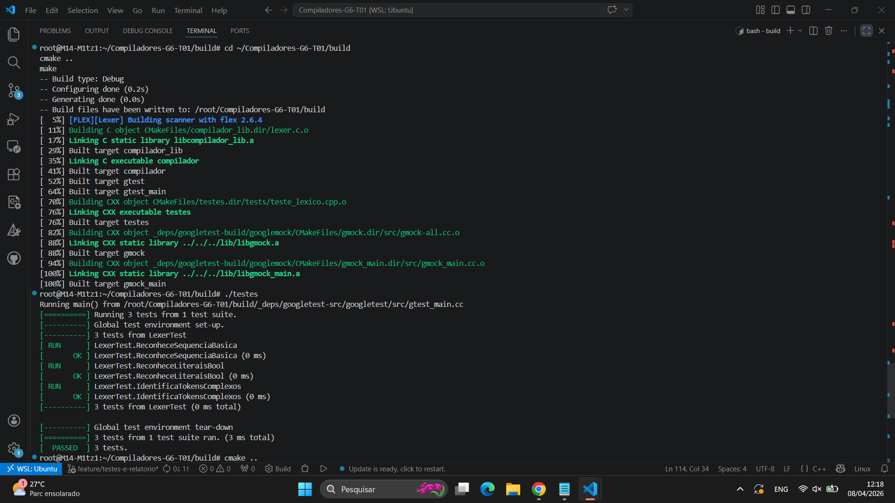
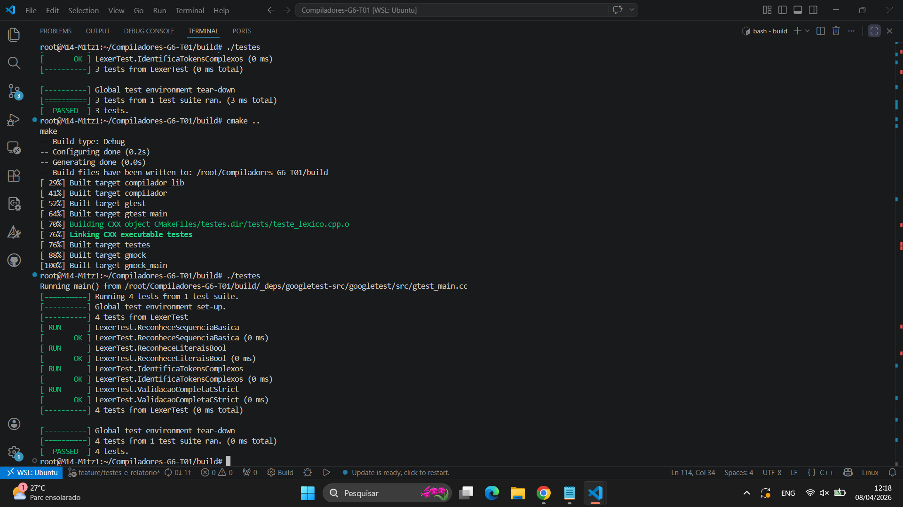
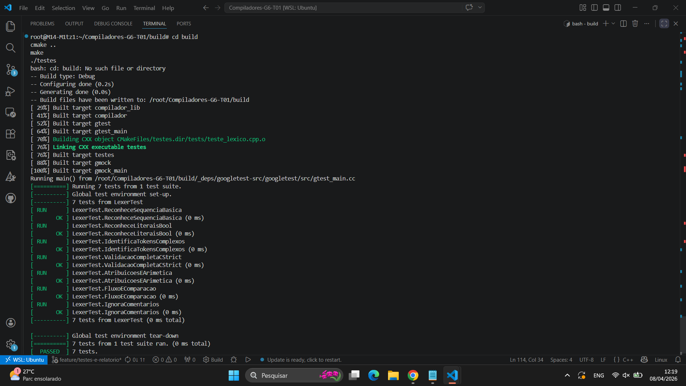

# Relatório Técnico de Desenvolvimento e Testes - Grupo 06
**Projeto:** Compilador C-- Strict (Versão Simplificada)  
**Ambiente:** Linux (WSL Ubuntu)  
**Data:** 08 de Abril de 2026  

---

## 1. Introdução e Objetivos
Este documento especifica a lógica de programação, os fundamentos teóricos e a validação prática da linguagem **C-- Strict**. O projeto visa a implementação de um compilador capaz de traduzir um subconjunto da linguagem C para código de máquina **Assembly x86-64**.

### Objetivos Centrais:
* **Implementação Direta:** Sintaxe desenhada para tradução direta em assembly.
* **Minimalismo:** Ausência intencional de ponteiros e alocação dinâmica (Heap).
* **Determinismo:** Toda a gerência de dados é delegada exclusivamente à **Pilha (Stack)**, garantindo previsibilidade semântica e evitando vazamentos de memória.

## 2. Descrição das Ferramentas e Tecnologias
O desenvolvimento utiliza um conjunto clássico de ferramentas de automação:
* **Flex (Fast Lexical Analyzer Generator):** Responsável pela Análise Léxica e identificação de tokens.
* **Bison (GNU Parser Generator):** Responsável pela Análise Sintática via gramática BNF e geração do cabeçalho de tokens.
* **C++:** Linguagem base para a lógica do backend e infraestrutura de testes.
* **Google Test (GTest):** Framework utilizado para garantir a integridade de cada fase do compilador.
* **CMake/Make:** Automação do processo de compilação e gerenciamento de dependências.

## 3. Fundamentação Teórica: Gramática e Lógica
A linguagem adota o paradigma **imperativo estruturado**. O fluxo lógico é construído de forma hierárquica (Sequência, Seleção e Iteração). 

### Gramática Livre de Contexto (CFG)
A definição formal segue o quádruplo $G = \langle V, \Sigma, P, S \rangle$, onde:
* **Terminais ($\Sigma$):** Tokens como `INT`, `IF`, `INC` (++), `PLUSEQ` (+=), etc.
* **Não-Terminais ($V$):** Estruturas abstratas como `<programa>`, `<declaração>` e `<expressão>`.

O comportamento do compilador foi ajustado para suportar **Shadowing** (sobrescrita de escopo) e **Tipagem Estática**. O uso de tokens específicos permite que o parser entenda operações complexas sem ambiguidade, tratando o incremento como uma operação atômica.

## 4. Metodologia de Teste de Unidade
Para validar o sistema, foram criadas baterias de testes focadas no Analisador Léxico. O maior desafio técnico foi a sincronização: o Lexer (Flex) precisa importar as definições do Bison para que os nomes dos tokens (`INC`, `ASSIGN`) sejam consistentes em todo o projeto.

### Códigos de Teste Utilizados (Exemplos):

```cpp
// Validação de Sequência, Operadores e Booleanos
TEST(LexerTest, ValidacaoCompletaCStrict) {
    auto buffer = yy_scan_string("int x = 10; x++; x += 5; true;");
    
    // Testa Declaração e Atribuição de Valor (yylval.intval)
    EXPECT_EQ(yylex(), INT);
    EXPECT_EQ(yylex(), IDENTIFIER);
    EXPECT_EQ(yylex(), ASSIGN);
    EXPECT_EQ(yylval.intval, 10);
    
    // Testa Incremento e Atribuição Composta (Tokens INC e PLUSEQ)
    EXPECT_EQ(yylex(), SEMICOLON);
    EXPECT_EQ(yylex(), IDENTIFIER);
    EXPECT_EQ(yylex(), INC); 
    EXPECT_EQ(yylex(), SEMICOLON);
    
    // Testa Literais Booleanos
    EXPECT_EQ(yylex(), BOOL_LITERAL);
    EXPECT_EQ(yylval.intval, 1); // True mapeado para 1 internamente

    yy_delete_buffer(buffer);
    yylex_destroy();
}

// Validação de Comentários e Espaços (Devem ser ignorados pelo Lexer)
TEST(LexerTest, IgnoraComentarios) {
    auto buffer = yy_scan_string("int x; // comentario\n x = 5; /* bloco */");
    EXPECT_EQ(yylex(), INT);
    EXPECT_EQ(yylex(), IDENTIFIER);
    EXPECT_EQ(yylex(), SEMICOLON);
    // O Lexer deve saltar o comentário e identificar o próximo identificador 'x'
    EXPECT_EQ(yylex(), IDENTIFIER);
}
```

## 5. Resultados e Comportamento do Sistema
O sistema apresentou **100% de aproveitamento** nos testes unitários. O comportamento observado confirmou a robustez da análise léxica e a correta integração com o Google Test.

### Evidências de Execução:

**Etapa 01: Configuração e Build** O CMake vinculou corretamente as bibliotecas do Google Test e gerou o ambiente de compilação sem avisos de erro.  


**Etapa 02: Primeiras Validações de Tokens** Reconhecimento de sequências básicas e palavras-chave de controle de fluxo.  


**Etapa 03: Status Final PASSED** Execução de 7 testes unitários simultâneos, cobrindo operadores unários, binários e tratamento de comentários.  


## 6. Guia de Execução (Do Zero)
Para reproduzir este relatório no ambiente WSL:

1. **Clonar e Acessar:** `cd ~/Compiladores-G6-T01`
2. **Criar Branch de Trabalho:** `git checkout -b feature/testes-e-relatorio`
3. **Limpar e Compilar:**
   ```bash
   rm -rf build && mkdir build && cd build
   cmake ..
   make
4.Executar Testes:
    ./testes