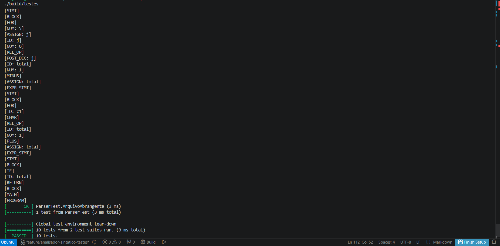

# Relatório Técnico: Analisador Sintático - Grupo 06

**Projeto:** Compilador C-- Strict  
**Fase:** Análise Sintática (Parser)  
**Ferramentas:** Bison (GNU Parser Generator), Flex, GTest  
**Ambiente:** WSL Ubuntu 22.04  

---

## 1. Introdução
Esta etapa do projeto consistiu na implementação do **Analisador Sintático**, responsável por validar se a sequência de tokens gerada pelo Lexer obedece às regras estruturais da linguagem **C-- Strict**. O parser foi construído utilizando a técnica **LALR(1)**, processando a gramática de forma ascendente (bottom-up).

## 2. Estrutura da Gramática
A gramática foi definida em notação similar à BNF (Backus-Naur Form). Os principais componentes estruturais incluem:

* **Símbolo Inicial:** `program`, que permite uma lista de declarações globais seguida obrigatoriamente pela função `main`.
* **Escopo:** Suporte a declarações de variáveis locais no início de blocos `{ }`.
* **Controle de Fluxo:** Implementação robusta de `if-else`, `while` e `for`.

### Resolução de Ambiguidade: Else Órfão (Dangling Else)
Para evitar conflitos de *shift/reduce* no Bison, a gramática foi dividida em `matched_statement` e `unmatched_statement`. Isso garante que cada cláusula `else` seja vinculada ao `if` mais próximo possível, mantendo o determinismo do parser.

## 3. Precedência e Associatividade
A hierarquia das expressões foi implementada de forma a garantir que as operações matemáticas sigam as regras universais de aritmética sem necessidade de parênteses excessivos:

| Nível | Operadores | Descrição |
| :--- | :--- | :--- |
| 1 (Mais alto) | `( )`, `ID()`, `++`, `--` | Primários e Sufixos |
| 2 | `!`, `-`, `++`, `--` | Unários (Prefixo) |
| 3 | `*`, `/`, `%` | Multiplicativos |
| 4 | `+`, `-` | Aditivos |
| 5 | `>`, `>=`, `<`, `<=`, `==`, `!=` | Relacionais |
| 6 | `&&` (and) | Lógico AND |
| 7 (Mais baixo) | `||` (or) | Lógico OR |

## 4. Metodologia de Teste de Estresse
Foi utilizado um arquivo de teste abrangente (`teste_parser.cmm`) contendo construções complexas para validar a árvore sintática.

### Código de Teste C++ (Google Test)
Este código automatiza a leitura do arquivo e verifica se o `yyparse()` retorna `0` (sucesso).

```cpp
#include <gtest/gtest.h>
#include <cstdio>

#include "tokens.hpp"

int yyparse(void);
int yylex_destroy(void);
extern FILE *yyin;
extern int line;

TEST(ParserTest, ArquivoAbrangente) {
    // Abre o arquivo de estresse (caminho relativo a raiz do projeto)
    FILE* fp = fopen("tests/parser/teste_parser.cmm", "r");
    ASSERT_NE(fp, nullptr) << "Erro: Arquivo .cmm não encontrado!";

    yyin = fp;
    line = 1;

    // O parser deve reduzir todas as regras com sucesso
    int resultado = yyparse();

    fclose(fp);
    yylex_destroy();

    EXPECT_EQ(resultado, 0) << "O parser encontrou um erro sintático inesperado.";
}
```

> O teste reside em `tests/parser/teste_sintatico_parser.cpp` e usa o fixture `tests/parser/teste_parser.cmm`. Ele é compilado junto com a suíte e executado via `ctest` (a partir da raiz do projeto, conforme `WORKING_DIRECTORY` definido no `tests/CMakeLists.txt`).

## 5. Resultados e Evidências

O **Analisador Sintático** demonstrou sucesso ao reduzir estruturas complexas, validando a integridade da árvore sintática. Durante os testes, o parser processou corretamente:
* **Funções com múltiplos parâmetros:** Validação de listas de argumentos e tipos.
* **Recursividade:** Processamento fluido de listas de instruções e declarações locais.
* **Expressões Lógicas Aninhadas:** Correta precedência de operadores (`and`, `or`, `not`) e operadores relacionais.

### Log de Execução (Reduções Sintáticas)

Abaixo, um fragmento do log gerado pelo compilador durante a redução (bottom-up) do arquivo de estresse:

```text
[TYPE:int]
[PARAM: a]
[TYPE:int]
[PARAM: b]
[PARAMS]
[ID: a]
[ID: b]
[PLUS]
[RETURN]
[BLOCK]
[FUNCTION_DEF]
[GLOBAL_DECL: soma]
[GLOBAL_LIST]
[MAIN]
[PROGRAM]
[==========] 10 tests from 2 test suites ran.
[  PASSED  ] 10 tests.
[GLOBAL_DECL: soma]
[FUNCTION_DEF]
[TYPE:int]
[ID: a]
[ID: b]
[PLUS]
[RETURN]
[BLOCK]
[MAIN]
[PROGRAM]
[  PASSED  ] ParserTest.ArquivoAbrangente
```

